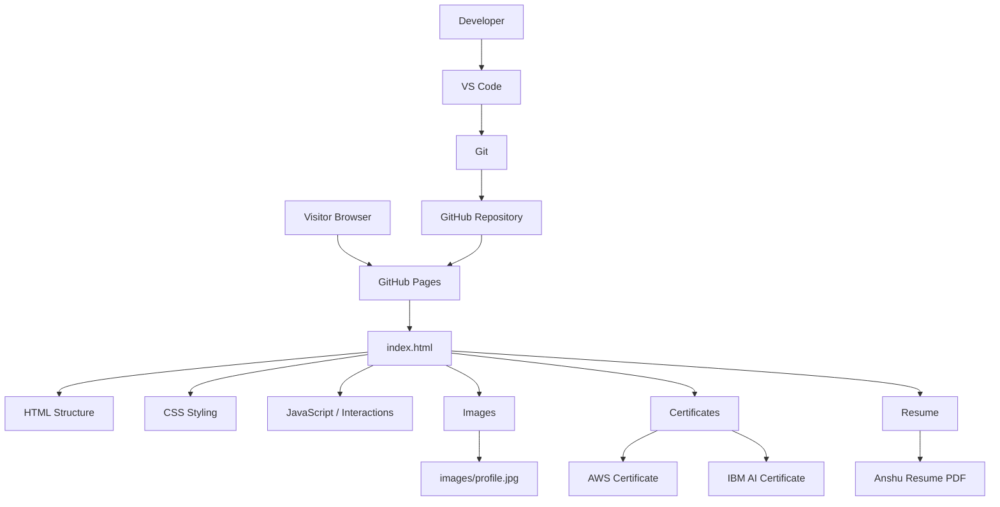
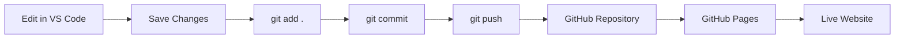

# Anshu Kumar Jha --- Cloud & DevOps Portfolio

> A modern personal portfolio website showcasing my Cloud Technology,
> DevOps skills, projects, resume, and certifications.

## 🌐 Live Website

`https://anshukumarjha917-sys.github.io/cloud-devops-portfolio/`

## 📌 Project Overview

This is my personal portfolio website built as a static web application.
It presents my profile, technical skills, projects, certifications,
resume, and contact information.

## 🏗️ System Architecture



### Deployment Flow

``` text
VS Code
   │
   ▼
Git
   │
   ▼
GitHub Repository
   │
   ▼
GitHub Pages
   │
   ▼
Live Website
   │
   ▼
Visitor Browser
```

## 🧩 Project Structure

``` text
cloud-devops-portfolio/
│
├── index.html
│
├── images/
│   └── profile.jpg
│
├── certificates/
│   ├── AWS_Cloud_Practitioner.pdf
│   └── IBM_AI_Certificate.png
│
├── resume/
│   └── Anshu_Resume.pdf
│
└── README.md
```

## ⚙️ Technology Stack

-   HTML5
-   CSS3
-   JavaScript
-   SVG
-   Responsive Web Design
-   Git
-   GitHub
-   GitHub Pages
-   VS Code
-   Git Bash

## 🔄 Deployment / CI-CD Workflow



### Git Commands

``` bash
git add .
git commit -m "Describe your changes"
git push
```

## 📜 Certifications

### AWS Cloud Practitioner Essentials

Issuer: Amazon Web Services (AWS)

File:

``` text
certificates/AWS_Cloud_Practitioner.pdf
```

### IBM Artificial Intelligence Fundamentals

Issuer: IBM SkillsBuild

File:

``` text
certificates/IBM_AI_Certificate.png
```

## 📄 Resume

Resume file:

``` text
resume/Anshu_Resume.pdf
```

## 🚀 Run Locally

Clone the repository:

``` bash
git clone https://github.com/anshukumarjha917-sys/cloud-devops-portfolio.git
cd cloud-devops-portfolio
```

Open `index.html` in a browser or use VS Code Live Server.

## 🔐 Security

-   No AWS access keys or passwords are stored in the repository.
-   No private API secrets are included in the frontend.
-   Only public professional information is displayed.
-   GitHub Pages provides HTTPS for the deployed website.

## 🎯 Future Improvements

-   AWS-based deployment
-   CI/CD pipeline
-   Custom domain
-   Project analytics
-   Functional contact form
-   Cloud backend
-   Additional security features
-   More Cloud & DevOps projects

## 👨‍💻 About Me

I am a B.Tech student specializing in Cloud Technology and Information
Security, interested in Cloud Computing, AWS, DevOps, Linux, Networking,
Information Security, Automation, and AI.

## 📌 Project Status

🟢 Active Development

The portfolio is continuously updated with new projects, certifications,
skills, and improvements.

------------------------------------------------------------------------

⭐ If you find this project useful, consider starring the repository.
